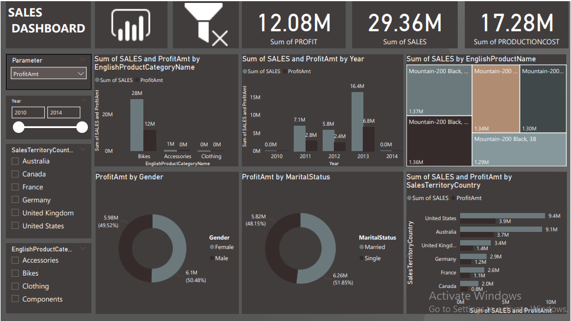

# ADVENTURE-WORKS-SALES-ANALYSIS
- Project Overview
 
This project analyzes an Adventure Works Cycle dataset containing DimCustomer ,DimDate ,DimSalesTerritory ,DimProduct ,DimProductCategory ,DimProductSubCategory ,Fact_Internet_Sales_new ,FactInternetSales. highlighting various dashboards that have been developed using a range of data analysis tools such as Excel, Power BI, Tableau, and SQL. Emphasis is placed on the principles of effective data visualization and analysis techniques, illustrating how these tools can be utilized to derive insights from complex datasets.

Focused on key business metrics like Sales, Profit, Production Cost, and Profit Margin (%) across different dimensions:
Demographic (Gender, Marital Status)
Time-based (Year, Month, Quarter)
Geographic (Country)
Product-based (Category and Top Products)
Data cleaning using tools like MYSQL , POWER QUARY , DATA MODELING IN POWER PIVOT AND TABLEAU AND POWER BI 

# Key Business Insights
- Consistent overall profit margin of around 41%, showing stable cost management.
- Top 5 Products (mainly Mountain Bikes) contributed significantly to revenue
- Bikes category is the most profitable among all product categories.
- United States led in both sales and profit, followed by Australia and the UK
- Gender & marital status distribution shows nearly equal purchase behavior.
- Profit margin improved in 2014 compared to earlier years, indicating better pricing or cost control strategies

## Dashboard Preview
# Power BI Dashboard

# Excel Dashboard

# Tableau Dashboard

## Download PDFs
## Download in Power BI
[Power BI Dashboard](AdventureWorksPowerBi.pdf)

## Download in Excel
[Excel Dashboard](Adventure%20Works%20Dashboard%20Excel.pdf)

## Download in Tableau
[Tableau Dashboard](Adventure%20Works%20Tableau.pdf)

## View Live Dashboard

You can explore the interactive dashboard on Tableau Public here: 
[View on Tableau Public](https://public.tableau.com/app/profile/sumit.sharma1352/viz/Adventure_Works_Sales_Analysis/Dashboard)

You can explore the interactive dashboard on Power bi Web here:  
[View on Power bi Web](https://app.powerbi.com/view?r=eyJrIjoiN2RlOWQ0MmEtN2JkYy00ODZiLTgzODYtYTgwYzg2MzQwOTQyIiwidCI6IjZmNWEzYzBiLWNmYTgtNDg4ZC1hNDNjLTQ3MzljN2MwMmNiYiJ9)

Customer Ratings: Most ratings fall under the “Good” category.
Discounts and Revenue: Products with 0%-5% discounts contribute the maximum sales amount.
